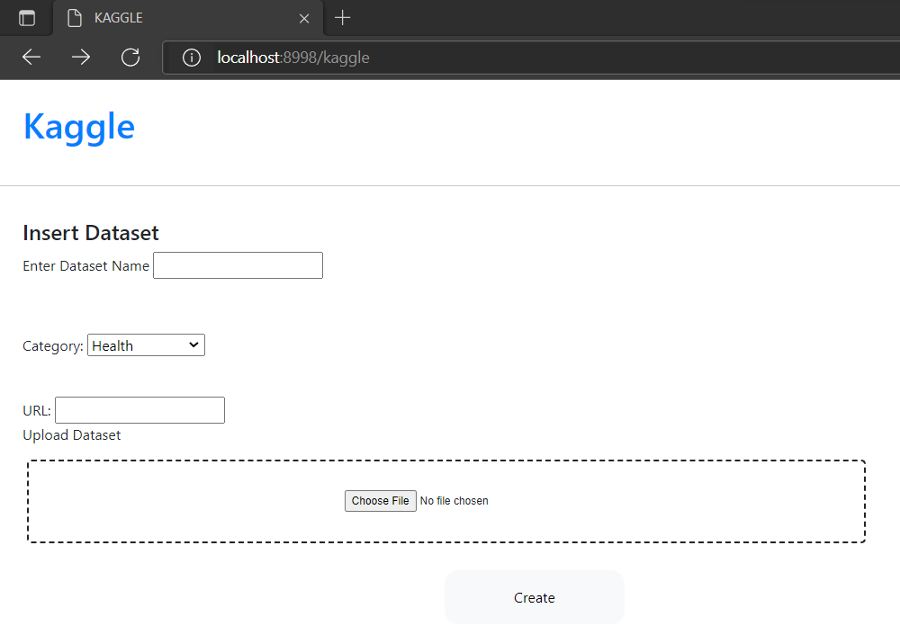

# Kaggle


## Requirements

For building and running the application you need:

- [JDK 1.8](http://www.oracle.com/technetwork/java/javase/downloads/jdk8-downloads-2133151.html)
- [Maven 3](https://maven.apache.org)
- [IntelliJ](https://www.jetbrains.com/idea/download/#section=windows)

## Software Pre-requisites

Need to have azure sql database and azure storage instances created.

Azure SQL database credentials
- azure_username
- azure_database_server
- azure_database
- azure_password

Azure Storage container credentials

- account_key
- account_name
- container_reference

## Create tables in Azure SQL

Query to create kaggle table

```shell
create table dbo.kaggle(dataset_id int primary key,dataset_name varchar(255),
url varchar(255), category varchar(255), 
dataset_location varchar(255));
```

Query to create users table
```shell
create table dbo.users (
       id int identity primary key,
        email varchar(45) not null,
        first_name varchar(20) not null,
        last_name varchar(20) not null,
        password varchar(64) not null
    );
```

Add unique constraint to email
```shell
alter table dbo.users add constraint users_email_constraint unique (email);
```


## Download Solr
Download [Solr](https://solr.apache.org/downloads.html) from this link.

## Start solr
After Downloading solr go to bin folder and in the command prompt run the following command.
```shell
solr start
```

## Setup Environment Variables

Open the project in [Intellij](https://www.jetbrains.com/idea/download/#section=windows) and set up the environment variables.

| Key                   | Value                                |
|-----------------------|--------------------------------------|
| account_name          | azure_storage_account_name           |
| account_key           | azure_storage_key                    |
| container_reference   | container_name                       |
| azure_database_server | azure_sql_server                     |
| azure_database        | azure_sql_database_name              |
| azure_username        | azure_sql_username                   |
| azure_password        | azure_sql_password                   |
| solr_url              | http://localhost:8983/solr/solr_core |

## Running the application

Run the application by hitting the button in IntelliJ.

# Executing the test case
## Creating the dataset

Open http://localhost:8998/

It will ask register or login.

If you are already an existing user, you can directly log in.

If you are a new user, you needs to register.


For creating a dataset fill out the fields and click create button.

| Key                | Value                                    |
|--------------------|------------------------------------------|
| Enter dataset name | dataset name that you want to give       |
| Category           | To which tag your dataset comes under    |
| URL                | URL that you can search upon             |
| Upload dataset     | Upload your dataset (maybe csv,json etc) |

## Searching the dataset

In the search box give your input and hit the search button.


## Download SonarQube
Download [SonarQube](https://www.sonarqube.org/downloads/) from this link.

## Start SonarQube

After Downloading SonarQube go to bin->windows-x86-64 folder and in the command prompt run the following command.
```shell
StartSonar.bat
```
Then add the following code in your pom.xml in plugins section
```shell
<plugin>
	<groupId>org.sonarsource.scanner.maven</groupId>
	<artifactId>sonar-maven-plugin</artifactId>
	<version>3.4.0.905</version>
</plugin>
<plugin>
	<groupId>org.jacoco</groupId>
	<artifactId>jacoco-maven-plugin</artifactId>
	<version>0.8.1</version>
</plugin>
```

The run the following codes
```shell
mvn clean install
```
In Maven Plugins run
```shell
jacoco:prepare-agent
```
```shell
sonar:sonar
```
It will display any bugs, vulnerabilities in your code.